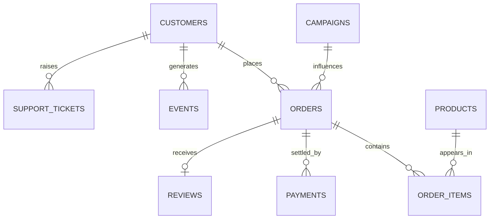

# Kalpa Retail

**The teaching spine.** Online and in-store consumer commerce across India and South-East Asia.
Weeks 1 to 4 teach in this unit and nowhere else, and it stays the spine afterwards while the second
worked example of each day rotates to another unit. A learner meets exactly one new idea at a time and
never spends the first ten minutes re-learning a domain.

The unit is under real pressure in the story: revenue grew 4 percent last year against a plan of 15,
and the CEO will not sign a marketing budget until the team can say where growth comes from and where
it is leaking. That is the question the whole programme answers at rising depth.

> Code `RET`. Ground truth is sections 1a, 4 and 6 of
> [`docs/07_Client_Zero.md`](https://github.com/fde-academy-lab/c2-content-factory/blob/main/docs/07_Client_Zero.md),
> LOCKED at v2.2.

---

## 1. Who runs it, and what each of them wants

These are the locked, named stakeholders. A trainer says them from memory and every artifact uses the
same names.

| Who | Measured on | What they want to hear | What they will resist |
|---|---|---|---|
| **Meera Raghavan**, CEO | The growth plan, and whether the board buys it | Where growth comes from and what to do about it, on one page in two minutes | A page that hedges. She would rather hear "not yet, and here is what would tell us". |
| **Anand Iyer**, finance controller | Whether the books and the dashboard agree | That your numbers reconcile to his and his analyst can audit how you got them | A figure computed from an ERP export that nobody reconciled |
| **The head of Retail-Plus** | The paid tier's revenue and frequency | That his tier is not the one slipping | A decomposition that lands the problem squarely in his tier |
| **The marketing lead** | Acquisition, and whether campaigns worked | That the Rs 12 crore acquisition budget is the right branch | Being told frequency moved and acquisition did not, or that a campaign's lift was a mix effect |
| **The data platform lead** | The warehouse | That you queried it rather than exported it | Anything that leaves the warehouse and becomes a second source of truth |
| **Kavya Nair**, senior analyst | The team's rigour | The baseline first, then the evidence, then the third way and a choice | A result with no baseline to beat |
| **Farhan Sheikh**, head of support, from Week 8 | Tickets handled and what each costs | That the model can read two thousand tickets a day and draft the reply | A cost per resolved case rather than a cost per call |

**The tension that generates most cards here:** marketing is measured on acquisition and the honest
answer is usually frequency. Every Week 1 and Week 2 card is somebody being told the branch they own
is not the branch that moved.

---

## 2. The data estate

The entity model is the locked one, and it is what the whole programme grows through: a list of
dictionaries in Week 1, files on disk, Postgres tables, a pandas frame, a feature table, then a
document corpus.

Segments are four: Retail-Core, Retail-Plus, Business and Student. Amounts are in Rs, with a typical
order between Rs 800 and Rs 3,000.

Three tables arrive later and on named days, so a day pack never reaches for one before it exists:
**campaigns** on Week 1 Thursday for the discount question, **reviews** on Week 7 Friday, and
**support tickets** on Week 8 Monday, when the Growth thread turns to text.

**What is deliberately absent, and why that matters more than what is present:**

| Missing | The question it forces |
|---|---|
| Staffing per store | Was footfall down, or was there nobody to serve them? |
| Competitor openings | Did demand fall, or did it move across the road? |
| Cost of goods | Is the highest-revenue category the most profitable one? |
| Store catchment boundaries | Are app orders in a pincode cannibalising the store, or new demand? |
| Any link between a store visit and a later app order | Who gets credit for the sale? |

Asking for what is missing is half the skill this unit teaches. A learner who accepts the file as
given has already failed the interview version of the question.

---

## 3. The KPIs, and how each one is gamed

| KPI | What people say it is | The denominator that decides it | How it breaks or gets gamed |
|---|---|---|---|
| **Footfall** | People walking into stores | Per **open store-day**, never per store | Two stores closing shrinks the estate and the total falls while every surviving store improves. Staff entries get counted. |
| **Conversion** | Transactions divided by footfall | Which visits count, and whether a later app order counts | A group of four counts as one entry and one transaction, so family shopping inflates it. A promotion inflates the denominator faster than the numerator. |
| **Average order value** | Revenue divided by orders | Orders placed, delivered, or net of returns | A handful of bulk buyers moves the mean and leaves the median flat. Reporting the mean is the default and it is usually the wrong statistic. |
| **Return rate** | Returns divided by orders | Placed, shipped or delivered, and this changes in dashboard releases | Returns arrive weeks after the order, so the current month always looks clean and every past month keeps rising. |
| **Repeat purchase rate** | Customers with two or more orders | The signup cohort, by month | A wave of new customers holds the blended rate flat while every individual cohort declines. |
| **Basket lift** | Products bought together | Lift against the base rate, never confidence alone | A very popular item reaches confidence 0.82 at lift 0.97, which means the association is weaker than chance and looks strong. |
| **On-shelf availability** | Whether a customer can buy it | The shelf, not the warehouse | Measured at the distribution centre it is always excellent and always irrelevant. |
| **Contribution per order** | Revenue minus goods, delivery, returns and payment fees | Per order, after the return window closes | Almost nobody computes it, and it reverses the ranking of "best channel" more often than not. |

**The one to teach first is the denominator.** Six of these eight break on it.

---

## 4. Case families, mapped to modules

| Week | The business question | What the room learns |
|---|---|---|
| 1 | What is "sales" made of, which lever moved, can we trust the numbers, is the gap real, did the discount cause the lift | The revenue tree, the sales-drop ladder, profiling and reconciliation, the permutation test, correlation against causation, the four-part note |
| 2 | The same numbers every Monday from the warehouse, booked against collected, the top members, one row per customer, the deck in Excel | SQL to CTEs, join semantics and fan-out, window functions, pandas groupby and merge, and the tool operating rule |
| 4 | Which metric should the plan chase, which pairs lift frequency, why did Retail-Plus frequency fall, how wrong could the forecast be | Metric design, basket lift against the confidence trap, cohorts and funnels, forecasting baselines |
| 5 | Who will buy again if nudged, and how good is that prediction honestly | The modelling loop on the `v6` feature table, imbalance at roughly 96 to 4, the `settlement_status` field that leaks |
| 7 | The tabular model has plateaued and customers also leave reviews and photos | Networks and training, and whether a network earns its place against logistic regression |
| 8 | Two thousand tickets a day, and what each answer costs | Tokens and cost, attention, embeddings and semantic search, decoding controls, the context budget |
| 10 to 12 | Answer customers from Kalpa's own policies, with citations | Prompting, structured output, retrieval, grounding, evaluation |
| 13 to 15 | Let the assistant act: resolve, refund within limits, escalate | Agents, tools, state, guardrails, cost per task |

---

## 5. The situations hosted here

| Page | Cards |
|---|---|
| [Analytics](Situations-analytics) | `S-RET-AN-01` (the footfall that fell but did not), `S-RET-AN-04` to `S-RET-AN-07` |
| [Machine learning](Situations-machine-learning) | `S-RET-ML-07` to `S-RET-ML-09` |
| [GenAI and agents](Situations-GenAI-and-agents) | `S-RET-GA-01` (right about the wrong policy), `S-RET-GA-04` to `S-RET-GA-07` |

---

## 6. What Retail must never be used for

1. **A second domain inside Weeks 1 to 4.** Module 1 teaches in Retail and nowhere else, because a room
   still learning the tools cannot absorb a new concept and a new domain at once. From Week 5 the
   second worked example rotates out: Financial Services, then Health, then Connect.
2. **Real data.** The spine is generated, seeded and identical for every learner. Real messy data
   appears only in build weeks.
3. **A case whose twist needs knowledge nobody in the room has.** If the answer turns on retail
   accounting conventions, it is a trivia question wearing a business costume.
