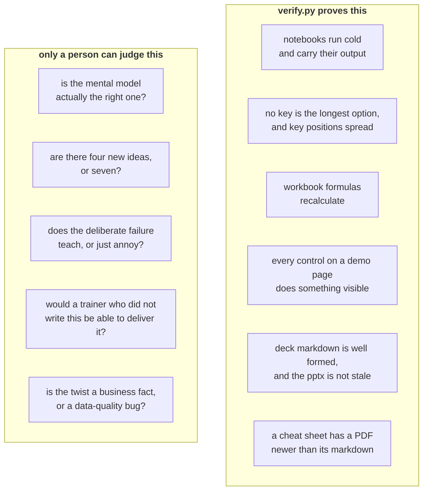

# Manual steps and checks

The things no script does for you, and the ones worth doing with your own eyes.

`scripts/verify.py` proves a great deal, and everything it proves is a fact about a file. It cannot
tell you whether a day is worth teaching. That part is yours.

---

## What the gate proves, and what it does not



A pack that passes the gate and fails the right-hand column is worse than one that fails the gate,
because it looks finished.

---

## The one command

```bash
python3 scripts/verify.py content/W03/D2
```

That runs all six proofs. Run it on the **folder**, never on one file, because half the failures are
about the relationship between two files: a stale `.pptx` beside a newer markdown, a cheat sheet
with no PDF, a notebook whose data file moved.

| Proof | What it fails on |
|---|---|
| `nb_check` | A notebook that does not run cold, has no saved output, has fewer than three rendered diagrams, or fewer than five passing checks |
| `distractor_audit` | A key that is the longest option, key positions that clump, a format line that leaks the answers |
| `xlsx_recalc` | A workbook value that is typed rather than derived |
| `html_sweep` | A control that does nothing, or a console that is not clean |
| `deck_md_check` | Malformed deck markdown, and a `.pptx` older than the markdown it came from |
| `deck_check` | A freshly built `.pptx` whose slides do not measure up |

---

## The manual pass, in the order that catches most

**1. Open the built files.** Not the markdown, the built artifact. The PDF, the `.pptx`, the
executed notebook as GitHub renders it. Most of what goes wrong is invisible in a diff.

**2. Read the diagrams at print size.** The hard rule is that a label under about five points on a
sheet or nine on a slide means the diagram gets reshaped shorter or narrower. It never means the
page shrinks it. If a label is unreadable, the fix is in the mermaid source.

**3. Count the new ideas in each block.** At most four per two-hour block. Count them as a learner
would, meaning every term they have to hold, not every heading.

**4. Find the deliberate failure and read its error text.** One per block, with the **exact** error
string. A failure described in prose instead of reproduced verbatim is not a deliberate failure, it
is a warning.

**5. Check application came before theory.** If the first thing in a block is a definition, the day
is the wrong way round.

**6. Read one exercise as a learner who is behind.** Not the strongest learner. The one who missed
Tuesday.

**7. Check the STUDENT files for the two leaks.** Clock times and trainer names. Durations only,
role labels only. This is the most common single defect in a first draft.

**8. Open every link.** Every URL carries the date it was verified. Open three at random. A link
that has rotted since it was dated is a fix, and a link with no date at all is a build failure.

**9. Read the trainer notes as somebody who did not write the day.** If a note assumes you were in
the room where the day was designed, it is not a trainer note.

---

## The checks that are easy to forget

| Check | How to do it fast |
|---|---|
| Nothing loose at the day folder root | `ls content/W03/D2` should show only folders |
| Every file has an audience suffix | `ls content/W03/D2/**/* \| grep -v -E '_(STUDENT\|TRAINER\|INTERNAL)\.'` |
| No em-dash anywhere | `grep -rn '—' content/W03/D2` should be silent |
| Rs, never the glyph | `grep -rn '₹' content/W03/D2` should be silent |
| The Kahoot pack exists | It is daily and ungraded, and it is the family most often skipped |
| The board card moved | `python3 scripts/board_sync.py --status W03/D2 review-1` after the merge |

---

## Before you commit anything written

1. Run the tic scrubber over it. Assembled-sounding prose passes every mechanical check and reads
   like nobody wrote it.
2. Read your own diff adversarially and ask what a reviewer would reject.
3. Then run the gate.

One validated commit beats three speculative ones, and this is a repository where a reviewer's time
is the scarce resource.

---

## What to do when a proof fails on a file you did not touch

**Report it. Do not fix it silently.**

A failure in somebody else's file is either a real defect they need to know about or a change in the
proof itself, and both of those are worth a sentence in the pull request. Quietly fixing it hides a
signal and enlarges your diff, which makes your own change harder to review.

If it blocks you, say so and fix it in a separate commit with its own message, so a reviewer can
read the two changes apart.
