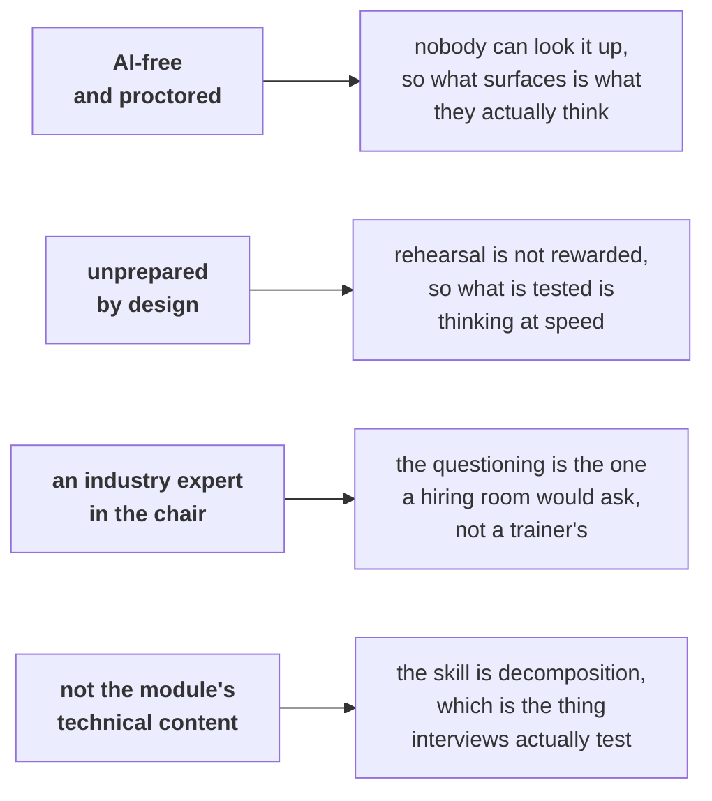
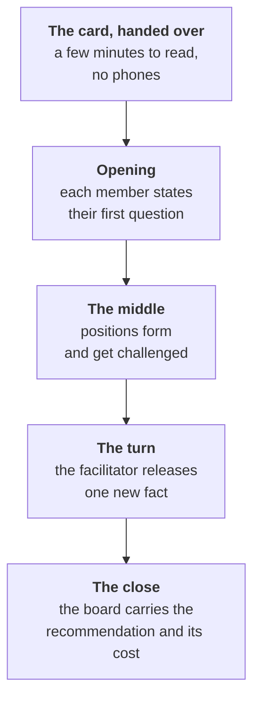

# Running a Situation Room

The build-week **business use case discussion**, and how to run one so it produces thinking rather
than performance.

The format is not a choice this wiki gets to make. It is fixed in the `Structure` tab of the
curriculum workbook and in the Week 3, 6 and 9 tabs: **the industry expert runs the group discussions
on the build week's Friday and Saturday, at about 30 minutes per group**, on that week's problem
space. It is unprepared by design, scored on a fixed rubric, AI-free and proctored, and it runs at
progressive complexity across the programme as a thread that is deliberately **not tied to the
module's technical content**.

At fifteen groups, thirty minutes each is about seven and a half hours of discussion, which is why it
spans both expert days. The Principal Advisor takes a share of the rounds online.

> Everything below is about how to use that format well. Nothing below changes it.
>
> **Changed 13 September 2026.** This page previously described a Monday discussion with 30 to 45
> minutes of preparation and an hour of discussion. That was the shape in an older programme facts
> table; the curriculum workbook and the Structure tab both carry the shape above, and both outrank
> it. Monday is now the Programme Head's online introduction, where groups scope their sub-problem.

---

## Why the format is shaped this way

The fourth one is the one people want to change, and it is the one that matters most. A discussion
about the module's own material becomes a viva. A discussion about a business problem the room has
never seen is the interview.

---

## Choosing the card

Take it from [The Situation Bank](The-Situation-Bank). The card should be **L3 Contested**: two
defensible answers, where the job is choosing and defending rather than finding.

| Level | Use it here? | What happens if you do |
|---|---|---|
| L1 Clean | No | The room finishes in nine minutes and talks about lunch |
| L2 Confounded | Only in Build 1 | There is one right answer, so the discussion becomes a race to find it |
| **L3 Contested** | **Yes, this is the level** | Two positions form, and both have to be argued |
| L4 Niche | Only in Build 5 | Most of the room has nothing to say, and two people dominate |

**Give the room only the top half of the card.** The complaint, the stakeholder, and what is in the
room. The `INTERNAL` half is for whoever is running it.

---

## The progressive complexity ladder

Five build weeks, and the thread gets harder in a specific way: not more data and not more maths,
but **more conflict between defensible positions**.

| Build week | What is added | The card shape |
|---|---|---|
| Build 1 | Nothing yet. One complaint, one obvious read that is wrong. | L2, with the twist findable inside the hour |
| Build 2 | A stakeholder with a motive who wants a particular answer | L3, where the honest answer is unwelcome |
| Build 3 | Two stakeholders who both have a case | L3, where the group has to pick a side |
| Build 4 | A cost on both sides of the decision, in the units the business uses | L3, where the trade-off has to be quantified before it is argued |
| Build 5 | A second-order effect: the decision changes the thing it was measuring | L3 escalating to L4 |

The industry leader who runs it is briefed for a mid-level management persona with eight or more
years of experience, which is exactly the person these cards are written for.

---

## The hour, in shape

Thirty minutes per group, so the shape below is tight. There is no separate preparation block: the
card is handed over at the start and the first question is asked almost immediately, which is exactly
what a case round does.

**Opening.** Ask each member for the first question they would ask the stakeholder, before anything
else. This single move separates the group in ninety seconds and it is the highest-signal moment of
the thirty minutes.

**The middle.** Let it run. The facilitator's job is to keep the disagreement about the business and
not about who spoke last.

**The turn.** Somewhere past the halfway point, release one fact from the `INTERNAL` half. Two
stores closed. The label lags ninety days. The reviewers approve in four seconds. A room that
re-plans cleanly around new information is showing you the skill the card exists to test.

**The close.** The group must state three things: the recommendation, the number it rests on, and
who is harmed if the other answer was right. A group that states only the first is not finished.

---

## What the facilitator does, and does not

| Does | Does not |
|---|---|
| Play the stakeholder, with the motive the card gives them | Play a neutral examiner |
| Answer a question the stakeholder would know the answer to | Answer a question the stakeholder would not know |
| Say "I do not have that" and mean it | Invent data to keep things moving |
| Release the turn fact once, at the right moment | Reveal the twist because the room is struggling |
| Push back on a confident wrong answer | Correct it |

**Saying "I do not have that" is the most useful thing in the room.** Real problems arrive with the
wrong data, and asking for what is missing is half the skill being trained.

---

## What to listen for

No marks or weights are set for any component of this programme, so this is an observation guide and
nothing more. It exists so two facilitators notice the same things.

| Signal | Sounds like | Weak version |
|---|---|---|
| **Asks before solving** | "Is the store count the same in both quarters?" | Reaching for a chart or a model in the first two minutes |
| **Names the denominator** | "Divided by what, exactly?" | Repeating the headline number back |
| **Separates the two questions** | "Did demand fall, or did the estate shrink?" | Treating one complaint as one cause |
| **Quantifies the trade-off** | "Calling 200 people to save 30 slots costs this much" | Asserting which side is right |
| **Says the unwelcome thing** | "The honest slide says the total fell" | Finding the answer the stakeholder wanted |
| **Re-plans on new information** | Rebuilds the position when the turn fact lands | Defending the first position harder |
| **Names what is missing** | "We would need the promotions calendar" | Working only with what was handed over |

The last three separate a good room from a strong one, and the sixth is the one that most often
distinguishes the person who will pass a real case round.

---

## The four ways this goes wrong

| Failure | What it looks like | The fix |
|---|---|---|
| **The quiz** | The facilitator knows the answer and the room is guessing at it | Use an L3 card. If there is one right answer, this format is the wrong one. |
| **The presentation** | The group starts performing rather than thinking | The discussion is not the Saturday presentation. Say so at the start and mean it. |
| **The two voices** | Two confident people, two silent ones | Open by going round every member for their first question, and question the silent ones separately. |
| **The rescue** | The facilitator reveals the twist because the room is stuck | Being stuck is the exercise. Release the turn fact, and let the rest stand. |

---

## After the room

The `INTERNAL` half of the card is worth reading out once the group has stated its recommendation, because the value of
the hour doubles when the room finds out what it missed and why missing it was reasonable.

If a card produced a new twist nobody expected, that is a contribution. Write it into the bank with
a new identifier. See [Contributing a situation](The-Situation-Bank#contributing-a-situation).
