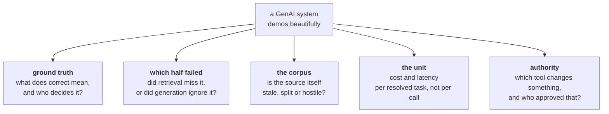

# Situations: GenAI and agents

Modules 4 to 9, from NLP through to multi-agent systems. The situations where **the demo was
flawless and the system cannot be
trusted.**

Analytics and ML both have a number you can be wrong about. This page mostly does not. The
distinguishing skill here is building a way to know whether the thing got worse, in a setting where
there is no answer key, the model underneath changes without you, and some of the text arriving is
written by a person who wants to steer you. Published interview guidance for AI engineer roles is
consistent about what gets probed: whether a candidate can separate retrieval failure from
generation failure, how they evaluate beyond accuracy, and which production failure modes they can
name unprompted
([MyEngineeringPath](https://myengineeringpath.dev/genai-engineer/system-design-interview/),
[BuildML on RAG interviews](https://buildml.substack.com/p/top-interview-questions-on-rag-for),
checked 10 Sep 2026).

> Read [The Situation Bank](The-Situation-Bank) first for the card format and the difficulty ladder.

---

## The five mechanisms

The first four are evaluation problems wearing different hats. The fifth is a security problem, and
it is the one that separates people who have run an agent in production from people who have built
one.

---

## Flagship cards

### S-RET-GA-01 · The assistant that is right about the wrong policy

| | |
|---|---|
| **Unit** | Kalpa Retail |
| **Level** | L3 Contested, escalating to L4 |
| **Asked by** | Head of Customer Experience. Marketing wants the assistant on the homepage next month. |
| **Origin** | `seed`. Corpus conflict and faithful-but-wrong retrieval are documented production RAG failure modes; see the sources above. |

**What they say**

"The assistant closes 68 percent of tickets without a human. Deflection is the best number we have
ever had and customer satisfaction has dropped four points. Tell me whether we can promote it."

**What is in the room**

Fourteen months of ticket transcripts. The policy knowledge base, exported from the wiki the
operations team keeps. The returns policy as a PDF. Deflection logs. Satisfaction survey responses,
with a nine percent response rate. There is no record of which knowledge base article the assistant
used for any given answer.

<b>INTERNAL: the twist, and what to listen for</b>

**What is actually true**

Three things, stacked, and only the middle one is a model problem.

1. **The corpus disagrees with itself.** There are three returns policies in the index: the current
   one, a variant for one state that has a different window, and a superseded draft that was never
   deleted. The draft is longer and more explicitly worded, so on some phrasings it wins on
   similarity. The assistant is quoting it accurately.
2. **Faithfulness is being confused with correctness.** The answer is fully supported by what was
   retrieved, so every faithfulness check passes. What was retrieved was wrong. An evaluation built
   only on "is the answer grounded in the context" scores this system as excellent.
3. **Deflection counts a closed conversation.** A customer who gives up is deflected. Satisfaction
   at a nine percent response rate is measuring the people who still had the energy to answer a
   survey, which is a different population from the people the assistant failed.

**Why the obvious read fails**

The instinct is to blame hallucination and reach for a better prompt or a stricter grounding rule.
The model is not hallucinating. Every improvement to the generator makes this worse, because a more
obedient generator quotes the wrong document more confidently.

**The first question a strong candidate asks**

"When it is wrong, is it wrong because retrieval brought the wrong document, or because generation
ignored the right one?" A candidate who cannot answer that has no diagnosis path at all, and the
system as built cannot answer it either, because the retrieved passages were never logged. The
second question is "does the corpus contain exactly one answer to this question?"

**The KPI that settles it**

Repeat contact on the same issue within seven days, which is resolution rather than deflection.
Alongside it, a **corpus conflict rate**: the share of queries where the top passages disagree with
each other. That second number is computable today, needs no human labelling, and nobody is looking
at it.

**Where it turns technical**

Effective dating and versioning as index metadata rather than as folder discipline, a retrieval log
that stores what was retrieved with every answer, and the separation of a faithfulness check from a
correctness check. This is a whole build week if you want it to be.

**How it escalates**

**To L4.** The assistant's own transcripts are being used as examples for the next iteration, so its
confident wrong answers are becoming the reference for what a good answer looks like. Then ask what
happens when the same assistant is given a tool that issues a refund, and where the limit on that
tool is written.

---

### S-FIN-GA-02 · The agent that read the customer's email

| | |
|---|---|
| **Unit** | Kalpa Financial Services |
| **Level** | L4 Niche |
| **Asked by** | Head of Servicing. Legal has asked whether the human review step can be dropped. |
| **Origin** | `seed`. Indirect prompt injection through content a business is obliged to process is a documented agent failure mode. |

**What they say**

"The agent reads inbound customer email, pulls up the account, and drafts a reply. It handles
address changes and statement requests. Reviewers edit only eleven percent of the drafts, so the
quality is there. Can it send without a human?"

**What is in the room**

The agent's tool list: `lookup_account`, `update_address`, `issue_statement`, `send_email`. The
system prompt. Three months of run logs with timestamps. The reviewers' edit rate. No record of how
long a reviewer spends on a draft.

<b>INTERNAL: the twist, and what to listen for</b>

**What is actually true**

Three failures, and the candidate who finds only the first has found the easy one.

1. **The email body is an instruction channel.** The agent cannot distinguish the customer's words
   from its own operator's words, because both arrive as text in the same context. Anyone who can
   send email to the servicing address can write instructions to the agent. This is text the
   business is contractually required to read, so the attack surface cannot be closed by filtering
   the sender.
2. **The eleven percent is not a quality measure.** The run logs carry timestamps, and the median
   gap between a draft appearing and a reviewer approving it is a few seconds. Once a person's job
   is to approve, they approve. A human in the loop that has never rejected anything is a control on
   paper and a rubber stamp in practice.
3. **The tools are not equal and are treated as equal.** `update_address` looks routine and it is
   the highest-risk call in the list, because the address on file is the recovery path for
   everything else. Changing it is the precondition for the fraud rather than the fraud itself.

**Why the obvious read fails**

Every instinct here points at the model: a better prompt, a stricter instruction, a bigger model.
None of those is a control, because each one is enforced by the component under attack. A defence
the attacker's text can talk to is not a defence.

**The first question a strong candidate asks**

"Which of these tools changes state, and which one changes state that unlocks another tool?"
Classifying tools by blast radius rather than by call frequency is the signal. The second question
is "where does the untrusted text end and the instruction begin, and what enforces that boundary
outside the model?"

**The KPI that settles it**

Not accuracy and not edit rate. Seed the inbox with known-bad requests, then measure the rate at
which the agent takes an authority-changing action on them and the share a reviewer caught. A review
step that catches none of the seeded cases has been measured and found to be decorative.

**Where it turns technical**

Authorisation enforced at the tool boundary rather than in the prompt, a step-up rule that sends an
address change out of band to the number already on file, and a separation between the channel that
carries data and the channel that carries instructions. This is the material for the advanced
agentic module and it is genuinely hard.

**How it escalates**

**Downward, to L3,** if you want it in a build week: keep the injection out and ask only whether a
reviewer who approves in four seconds is a control, and what you would measure to find out.

**Further at L4.** Ask what the agent should do when the customer's request is legitimate and the
account is flagged. An agent with no way to say "I am not allowed to answer this" will answer it.

---

### S-HLT-GA-03 · We changed nothing and it got worse

| | |
|---|---|
| **Unit** | Kalpa Health |
| **Level** | L3 Contested, escalating to L4 |
| **Asked by** | Clinical operations lead, after a doctor complained about a summary |
| **Origin** | `seed`. Silent model version change with no stored baseline is a standard production GenAI failure. |

**What they say**

"The lab report summariser was signed off in March by two clinicians. In July a doctor said a
summary was misleading. Nothing on our side has changed since March. Find out what happened."

**What is in the room**

The prompt, unchanged in version control since March. The March evaluation spreadsheet: forty
reports, reviewed by two clinicians, with a single overall verdict per report. The vendor's release
notes. The reports themselves. No stored outputs from March.

<b>INTERNAL: the twist, and what to listen for</b>

**What is actually true**

1. **Nothing on their side changed and the system changed anyway.** The model behind the API was
   updated. "We changed nothing" is true and beside the point, because the dependency was never
   pinned and its behaviour was never captured.
2. **The evaluation cannot be re-run.** Forty examples with one verdict each, reviewed once, with no
   stored outputs. There is nothing to compare July against. It was a sign-off, and a sign-off is a
   memory rather than a baseline.
3. **There is no answer key and there never was.** Two clinicians disagreed on six of the forty in
   March and settled it by talking. That conversation is the ground truth, and it was not written
   down. Any attempt to score July against "correct" has to invent the thing it is scoring against.

**Why the obvious read fails**

The room wants to diff the code, find nothing, and conclude the doctor is wrong. The absence of a
diff is the finding.

**The first question a strong candidate asks**

"What did this system output in March for the inputs it is getting today, and where is that stored?"
The general form is that an evaluation you cannot re-run on demand is not an evaluation.

**The KPI that settles it**

A frozen regression set with per-item judgments recorded rather than resolved away, a pinned model
version, and inter-rater agreement measured so that the noise floor of the evaluation is known. If
two clinicians agree on 34 of 40, a four-point move means nothing.

Alongside that, the checks that need no answer key at all, which is where a strong candidate earns
the round:

| Check | What it catches | Needs a label? |
|---|---|---|
| Every number in the summary appears in the source report | Fabricated values, the failure clinicians care most about | No |
| Every clinical claim carries a span that can be located in the source | Unsupported assertion | No |
| Refusal on a seeded set of reports that genuinely cannot be summarised | Over-confidence on bad input | The seed set only |
| Output stability across repeated runs of the same input | Silent drift and prompt fragility | No |
| Two retrieved sources contradicting each other | A corpus problem masquerading as a model problem | No |

**Where it turns technical**

Version pinning, golden sets, and the calibration of a model judge against the human labels you do
have, together with the awkward fact that the judge is a model too and drifts on the same schedule.

**How it escalates**

**To L4.** For some reports the correct behaviour is to refuse, and refusal correctness needs its
own evaluation set, because a refusal is perfectly faithful and perfectly grounded and can still be
wrong. A summariser that declines a report it should have summarised fails a clinic quietly, and no
faithfulness metric in existence will report it.

---

## Seeded situations, ready to expand

| ID | Unit | Level | What they say | The twist underneath |
|---|---|---|---|---|
| `S-RET-GA-04` | Retail | L2 | "Search got worse when we moved to embeddings" | Exact SKU and product codes stopped matching. Dense retrieval does not do exact match, and identifiers need lexical search alongside it. |
| `S-RET-GA-05` | Retail | L2 | "The assistant handles 90 percent of chats" | Ninety percent of sessions. Hard issues generate four sessions each because the customer retries, so per-issue containment is far lower. |
| `S-RET-GA-06` | Retail | L3 | "Generated product descriptions beat the manual ones on click-through" | Generation was run on the top sellers first. The manual comparison group is the long tail, which was never going to convert. |
| `S-RET-GA-07` | Retail | L4 | "Review summaries per product, straight from the reviews" | Some reviews are written by the sellers. The corpus is adversarial and the design assumed it was neutral. |
| `S-FIN-GA-08` | Financial Services | L2 | "Retrieval accuracy is 94 percent" | Measured as the right document appearing in the top five. The prompt budget only carries the top one, so the metric and the system disagree about what retrieval means. |
| `S-FIN-GA-09` | Financial Services | L3 | "Cost per query is under half a rupee, so it is cheap" | Per query. A resolved case is fourteen queries, two tool calls and a retry. Nobody has computed cost per resolved case, which is the only unit the business buys. |
| `S-FIN-GA-10` | Financial Services | L4 | "The reasoning trace explains the decision to the regulator" | The trace is generated alongside the answer and is not the cause of it. Presenting it as an explanation is a claim that has never been tested. |
| `S-LOG-GA-11` | Logistics | L2 | "The address parser is 97 percent accurate" | Accurate on addresses that were already deliverable. The three percent it fails on are exactly the malformed ones a human was employed to fix. |
| `S-LOG-GA-12` | Logistics | L3 | "The agent replans the route whenever a driver is delayed" | It replans on every location ping, so a route changes six times an hour. The unwritten constraint is that a human needs a plan that holds still. |
| `S-LOG-GA-13` | Logistics | L4 | "Latency is fine, the median is 800 milliseconds" | The driver app times out at three seconds and the multi-tool path has an eleven-second tail. A median is not a service level on a system with tool calls in it. |
| `S-CON-GA-14` | Connect | L2 | "It answers plan questions correctly in testing" | Tested by the team that wrote the knowledge base, using the knowledge base's own vocabulary. Customers ask in different words, so the evaluation set and production do not share a query distribution. |
| `S-CON-GA-15` | Connect | L3 | "Fine-tune it on two years of our own transcripts" | The transcripts record what agents said, including what they said wrongly, and no turn carries a label for whether it was good. |
| `S-CON-GA-16` | Connect | L4 | "We added a guardrail and blocks fell to zero" | The guardrail fails open on timeout, and timeouts rose with traffic. A control whose failure mode looks like success is worse than no control. |
| `S-HLT-GA-17` | Health | L3 | "It must never give medical advice, so the prompt says not to" | The boundary is enforced by the component being bounded. The unmeasured cost is the other direction, where it refuses legitimate operational questions and staff stop using it. |

---

## Five questions to ask before any GenAI build

1. **What does correct mean here, and who decides?** If no one in the room can name the person who
   settles a disagreement, there is no evaluation and there will not be one later.
2. **When it is wrong, can you tell which half failed?** Retrieval and generation fail differently
   and are fixed differently. A system that does not log what was retrieved cannot be debugged.
3. **What is the unit of cost and the unit of value?** Per resolved task on both sides, because
   nobody buys a token and nobody sells a call.
4. **Which tools change state, and what authorises that outside the model?** Any answer that lives
   in the prompt is not an answer.
5. **What is the correct refusal, and is it in the test set?** Refusals are invisible to every
   grounding metric, so they only exist if somebody wrote them down as expected behaviour.

A candidate who asks these five before proposing an architecture is doing the job. One who opens
with a vector database has answered a question nobody asked.
