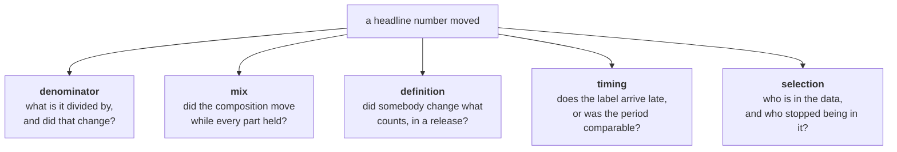

# Situations: analytics

Module 1, Foundations of AI and Data. The situations where **the number is right and the conclusion
is wrong.**

Almost every card here turns on one of five things: a denominator nobody checked, a mix that
shifted, a definition that changed, a label that arrives late, or a comparison across a period that
was not comparable. Learn those five and most analytics interview traps become recognisable in the
first minute.

> Read [The Situation Bank](The-Situation-Bank) first for the card format and the difficulty ladder.

---

## The five mechanisms

---

## Flagship cards

### S-RET-AN-01 · The footfall that fell but did not

| | |
|---|---|
| **Unit** | Kalpa Retail |
| **Level** | L2 Confounded |
| **Asked by** | Head of Retail Stores, in the Monday review. Her store-expansion plan is up for approval next month. |
| **Origin** | `built` on a mix-shift pattern that is standard in multi-store retail |

**What they say**

"Footfall is down eleven percent this quarter against last. I need to know why before Friday, and I
need it to not be about the stores."

**What is in the room**

Daily entry counts per store. The store master, with open and close dates. The promotions calendar.
App delivery orders by pincode. Nothing on staffing, and nothing on the competitor that opened in
two of the catchments.

<b>INTERNAL: the twist, and what to listen for</b>

**What is actually true**

Two stores closed mid-quarter. Total footfall across a shrinking estate fell. **Footfall per open
store rose four percent.** Separately, app delivery orders in the same pincodes rose sharply: the
customers did not leave, they stopped walking in.

**Why the obvious read fails**

"Footfall is down" invites a demand story. The demand is fine. Two different things moved: the
estate shrank, and the channel shifted. Either one alone would be a different recommendation.

**The first question a strong candidate asks**

"Is the store count the same in both quarters?" Anyone who asks this in the first two minutes has
the instinct. Anyone who goes straight to a weekly trend chart does not.

**The KPI that settles it**

Footfall per open store-day, and total served customers across both channels. Neither of them is
"footfall".

**Where it turns technical**

Building a like-for-like panel: only stores open for the whole of both periods. That is a join, a
date filter and a defended exclusion rule, which is a Week 1 to Week 2 skill.

**How it escalates**

**To L3.** She asks: "So do I report the like-for-like number or the total?" Both are honest and
they support opposite decisions. Like-for-like defends the stores. Total says the footprint is
shrinking, which is the thing the CFO wants to know. The candidate must pick and say who is
harmed by the other choice.

**To L4.** The two closed stores were the two worst performers. Closing the tail raises the average
mechanically. Any comparison of the survivors against history now carries a selection effect, and
"footfall per store improved" is partly an artefact of which stores remain.

---

### S-CON-AN-02 · The retention that improved because the unhappy left

| | |
|---|---|
| **Unit** | Kalpa Connect |
| **Level** | L3 Contested |
| **Asked by** | VP Subscriptions, preparing a board slide |
| **Origin** | `built` on the survivorship pattern in cohort retention |

**What they say**

"Month-three retention has gone from 61 to 68 percent over four cohorts. Put it in the board pack
and tell me what we did right."

**What is in the room**

Signup date, plan, acquisition channel and cancellation date per subscriber. The marketing spend by
channel. No record of which promotions ran on which channel.

<b>INTERNAL: the twist, and what to listen for</b>

**What is actually true**

Marketing cut a cheap high-volume acquisition channel two quarters ago. That channel brought
subscribers who churned fast. Retention rose because **the people who used to drag it down stopped
arriving.** Retention within every channel is flat or slightly worse.

**Why the obvious read fails**

The blended metric moved because the mix moved. Nothing improved. Worse, total retained subscribers
fell, because the cut channel was large.

**The first question a strong candidate asks**

"Is this the same mix of acquisition channels in each cohort?" Or the general form: "Did the
composition of the cohort change?"

**The KPI that settles it**

Retention **within** channel, cohort by cohort, plus absolute retained count. The blended rate is
the one number that cannot answer the question asked.

**Where it turns technical**

A cohort table by signup month and channel, and the discipline not to average the averages.

**How it escalates**

**To L3, which is where this card lives.** The honest slide says retention per rupee improved and
total subscribers fell. The VP wants the 68. The candidate has to decide what goes in the board
pack and be able to defend it to the person whose number they just took away. This is the card to
use when the skill being tested is saying an unwelcome thing to a senior person.

**To L4.** Ask what the right counterfactual is. The cut channel was cheap; some of those
subscribers would have upgraded. Estimating what was given up needs an assumption nobody in the
room can settle, and naming that honestly is the answer.

---

### S-HLT-AN-03 · The month that always looks clean

| | |
|---|---|
| **Unit** | Kalpa Health |
| **Level** | L2 Confounded, escalating to L4 |
| **Asked by** | Operations lead for diagnostic labs |
| **Origin** | `built` on right-censoring, which is the most under-taught trap in operational reporting |

**What they say**

"Our sample rejection rate is under two percent this month, best ever. Last month was four. What
changed?"

**What is in the room**

Sample registration timestamps, test completion timestamps, rejection reasons where present. The
lab's own SLA document. No field saying whether a sample is still in progress.

<b>INTERNAL: the twist, and what to listen for</b>

**What is actually true**

Rejections are recorded when a sample fails, which is on average nine days after registration.
The current month is incomplete: most of its samples have not had time to be rejected yet.
**Every month looks clean while it is still running,** and every month's number rises for weeks
after it closes.

**Why the obvious read fails**

The metric is not wrong, it is unfinished. Comparing a partial month with a settled one compares
two different things.

**The first question a strong candidate asks**

"When is a rejection recorded relative to when the sample arrives?" The general form: "Is the
outcome for this period fully observed yet?"

**The KPI that settles it**

Rejection rate for cohorts of samples with a full nine-day (or the measured lag) maturity window,
or a fixed-lag report that only ever shows settled periods.

**Where it turns technical**

Measuring the lag distribution rather than assuming it, then defining a maturity cutoff. This is
the analytics ancestor of censored labels in machine learning, and the same card can be used again
in module 2 for exactly that.

**How it escalates**

**To L4.** The lag is not constant. Rejections for contamination surface in two days; rejections for
insufficient volume surface when the test is attempted, which for send-out tests can be three
weeks. A single maturity cutoff is wrong for the mix, and the right answer is a per-reason lag or a
survival-style estimate. Very few candidates reach this, and recognising it is a strong signal.

---

## Seeded situations, ready to expand

Each is a real mechanism with a named twist. Expand one into a full card when a day, a GD or a mock
needs it. **`seed`** means the mechanism is a documented industry pattern; **`built`** means it was
constructed for teaching.

| ID | Unit | Level | What they say | The twist underneath |
|---|---|---|---|---|
| `S-RET-AN-04` | Retail | L2 | "Return rate jumped to 9 percent" | The denominator changed from orders placed to orders delivered in a dashboard release. Numerator untouched. |
| `S-RET-AN-05` | Retail | L2 | "Q3 was terrible against Q2" | The festival week fell in Q2 this year and Q3 last year. The quarters were never comparable. |
| `S-RET-AN-06` | Retail | L3 | "Average order value is up, so the campaign worked" | Two populations. The mean moved because a handful of bulk buyers arrived; the median did not move at all. |
| `S-RET-AN-07` | Retail | L4 | "The stores we coached improved" | The worst-performing stores were chosen for coaching. Regression to the mean explains most of the gain, and there was no control group. |
| `S-CON-AN-08` | Connect | L2 | "Active users are down 8 percent" | The app release changed what counts as a session. The definition moved, the behaviour did not. |
| `S-CON-AN-09` | Connect | L3 | "Support contacts per subscriber are rising" | Contacts moved from phone, which is not instrumented, to chat, which is. Total contacts are flat. |
| `S-FIN-AN-10` | Financial Services | L2 | "Approval rates fell in the north region" | A single large partner in that region changed its own pre-filter, so the applicants arriving were different people. |
| `S-FIN-AN-11` | Financial Services | L3 | "Collections improved after the new script" | The script rolled out to the easiest arrears bucket first. The comparison is across different debt ages. |
| `S-FIN-AN-12` | Financial Services | L4 | "Our best channel is the one with the highest conversion" | Conversion is measured after a credit pre-check that differs by channel, so the denominators are not the same population. |
| `S-LOG-AN-13` | Logistics | L2 | "On-time delivery hit 96 percent" | Orders never delivered are not in the denominator. The failures dropped out of the metric entirely. |
| `S-LOG-AN-14` | Logistics | L3 | "Average delivery time improved by four hours" | The slowest pincodes were moved to a partner and stopped appearing in the dataset. |
| `S-LOG-AN-15` | Logistics | L4 | "Warehouse A is more efficient than B" | A handles the fast-moving lines; B handles the long tail. Per-line efficiency at A is worse. Aggregation reverses the ranking. |
| `S-HLT-AN-16` | Health | L2 | "No-show rate is 12 percent" | Rescheduled appointments are counted as both a no-show and a new appointment, so the denominator double counts. |
| `S-HLT-AN-17` | Health | L3 | "Test volume per clinic is falling" | Panel tests were unbundled into individual line items last year. The count of tests rose while the count of orders fell. |

---

## Using these on a teaching day

An L1 or L2 card is the day's business question: it opens the session, the notebook computes it,
and the close is the sentence the learner would send. An L3 card does not belong on a teaching day
unless the day is explicitly about judgment, because it has no single right answer and a room in
week two needs one.

The pattern that works: **open on the complaint, spend the day on the mechanics, close on the twist.**
The twist is the thing they remember on the train home.
