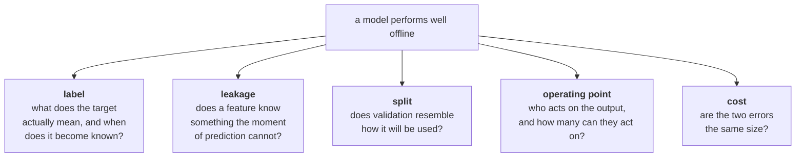

# Situations: machine learning

Modules 2 and 3, Applied Machine Learning and Deep Learning. The situations where **the model is
excellent and the system is useless.**

The pattern in hard ML interviews is consistent: the candidate is handed a problem, reaches for a
model, and never interrogates the label, the split, the operating point or the cost of being wrong.
Published guidance on ML interview cases says the same thing, that candidates are tested on whether
they can pick metrics, build honest validation and avoid leakage under realistic constraints, and
that a common failure is claiming strong performance without validating properly
([Data Interview](https://www.datainterview.com/blog/machine-learning-interview-questions),
[BuildML](https://buildml.substack.com/p/data-science-interview-guide-cracking), checked 10 Sep 2026).

> Read [The Situation Bank](The-Situation-Bank) first for the card format and the difficulty ladder.

---

## The five mechanisms

---

## Flagship cards

### S-FIN-ML-01 · Five hundred alerts a day

| | |
|---|---|
| **Unit** | Kalpa Financial Services |
| **Level** | L2 Confounded, escalating to L3 |
| **Asked by** | Head of Fraud Operations. She has nine analysts and no budget for a tenth. |
| **Origin** | `seed`. Capacity-constrained fraud triage is a standard hard interview case; see the sources above. |

**What they say**

"The model the last team built has 99.8 percent accuracy and it is useless. My analysts are drowning
and we are still paying out chargebacks. Fix it."

**What is in the room**

Eighteen months of transactions with a `chargeback_received` flag. Analyst review logs with a
disposition per reviewed case. The team of nine, who between them can work about 500 alerts a day
against roughly 300,000 daily transactions.

<b>INTERNAL: the twist, and what to listen for</b>

**What is actually true**

Three separate problems, and only the first is the one they think they have.

1. **The metric is the wrong shape.** At roughly 0.2 percent fraud, a model that says "never" is
   99.8 percent accurate. Accuracy cannot see this problem at all.
2. **The capacity is the product.** The business question is not "is this fraud" but "which 500 of
   300,000 do nine people look at today". That is precision in the top 500, not AUC.
3. **The label lags.** A chargeback lands 45 to 90 days after the transaction. The most recent three
   months of training data are labelled as clean because nobody has complained **yet**, so the model
   learns that recent patterns are safe.

**Why the obvious read fails**

Every one of these is invisible to a leaderboard metric. A model can win on AUC and be unusable.

**The first question a strong candidate asks**

"How many alerts can your team actually work in a day?" A candidate who asks about capacity before
asking about features is thinking about the system. The second question should be "when do you find
out a transaction was fraudulent?"

**The KPI that settles it**

Precision at 500, plus value recovered per analyst hour. Not AUC, not F1, and not accuracy.

**Where it turns technical**

Ranking rather than classifying, a threshold set from a capacity constraint rather than from 0.5,
and a training set that excludes the immature label window.

**How it escalates**

**To L3.** Analysts only ever review what the model surfaced, so the disposition labels exist only
for cases the model already liked. Every retrain learns from its own past decisions. Breaking that
needs a random holdout that gets reviewed regardless of score, which costs capacity the Head of
Fraud does not have. The candidate must argue for spending scarce analyst time on cases the model
thinks are fine, to a person who is already drowning. That negotiation is the real test.

**To L4.** Ask what happens to the denominator when fraud is prevented. A blocked transaction never
becomes a chargeback, so a successful model destroys its own future labels and looks like it is
degrading.

---

### S-HLT-ML-02 · The feature that already knew

| | |
|---|---|
| **Unit** | Kalpa Health |
| **Level** | L2 Confounded |
| **Asked by** | Clinic operations director, who wants to phone likely no-shows the day before |
| **Origin** | `built` on target leakage through an operationally-populated field |

**What they say**

"The no-show model is at 0.94 AUC in testing and it is barely better than a coin flip in the clinic.
The data science team says the data must have changed."

**What is in the room**

Appointment records with booking time, patient history, clinic, slot, and a set of operational
fields including `reminder_call_outcome`, `slot_released`, `rebooked_flag`. The training notebook.

<b>INTERNAL: the twist, and what to listen for</b>

**What is actually true**

`slot_released` is set by the front desk **when a patient fails to arrive**. It is in the training
data, it is the single strongest feature, and it does not exist at the moment the prediction has to
be made, which is the evening before. The model is reading the answer.

`reminder_call_outcome` is subtler and worth catching too: it is populated the day before, so it is
legitimately available, but "no answer" correlates with no-show partly because the same people are
unreachable. That one is a real feature with a fairness question attached, not leakage.

**Why the obvious read fails**

Nothing about the data changed. The offline number was never real. A validation split that shuffles
rows cannot see this, because the leaked field is present on both sides of the split.

**The first question a strong candidate asks**

"For each feature, at what moment does its value become known?" The discipline is a **point-in-time
audit** of every field against the moment of prediction. Candidates who talk about correlation with
the target rather than availability at inference are guessing.

**The KPI that settles it**

Performance on a strictly time-forward split, using only fields whose values are frozen as of the
evening before the appointment.

**Where it turns technical**

Reconstructing the feature set as of a timestamp, which is the same skill as building a point-in-time
feature store. This is where a build week can go deep.

**How it escalates**

**To L3.** Once leakage is removed, the model is weak but not worthless. The director asks whether it
is worth deploying. Calling 200 people to prevent 30 no-shows may or may not pay, and the answer
depends on the cost of an empty slot versus a receptionist's hour. The candidate has to build that
arithmetic, not a better model.

**To L4.** Ask what happens to the label after deployment. A patient who is called and then attends
was going to be a no-show and is now recorded as an attendance. The intervention destroys the label
it was trained on, and measuring the model after launch needs a holdout that is deliberately not
called. Explaining why that is ethically defensible in a clinic is part of the answer.

---

### S-LOG-ML-03 · The orders that have not arrived yet

| | |
|---|---|
| **Unit** | Kalpa Logistics |
| **Level** | L3 Contested |
| **Asked by** | Head of Last Mile, who has promised the retail unit a delivery-time estimate on the product page |
| **Origin** | `built` on right-censoring in an operational prediction target |

**What they say**

"Predict delivery time from order to doorstep. We want to show it on the product page. The data is
all there, two years of it."

**What is in the room**

Order timestamps, dispatch timestamps, delivery timestamps where present, pincode, courier partner,
weight band, and a status field. About four percent of rows have no delivery timestamp.

<b>INTERNAL: the twist, and what to listen for</b>

**What is actually true**

The four percent without a delivery timestamp are not missing data. They are **orders that were
never delivered**: lost, returned to origin, or still in transit after months. They are the worst
outcomes, and dropping them trains the model on a world where nothing ever goes badly wrong.

The prediction shown on a product page is also not a mean. A promise that is beaten half the time is
a promise broken half the time.

**Why the obvious read fails**

`dropna()` looks like hygiene and is actually a decision to ignore every failure. The mean absolute
error will look excellent and the customer promise will be wrong in exactly the cases that generate
complaints.

**The first question a strong candidate asks**

"What does a missing delivery timestamp mean?" The general form: "Is this missing at random, or is
missingness the outcome?"

**The KPI that settles it**

Not MAE. The business needs a quantile: the time by which, say, 90 percent of orders arrive, because
that is what can be promised. And a separate model or rule for the probability of not arriving at
all.

**Where it turns technical**

Quantile loss rather than squared error, and censored observations handled rather than dropped.
This is where survival analysis earns its place in a curriculum that otherwise would not justify it.

**How it escalates**

**To L3, which is where this card lives.** Retail wants an aggressive number because it converts.
Operations wants a conservative one because it is what gets missed. The model can produce any
quantile; choosing which one to show is a commercial decision with a cost on both sides, and the
candidate must present the trade-off rather than pick silently.

**To L4.** The displayed promise changes behaviour. A longer quoted time loses the impatient
customer, so the orders that get placed are different, so the delivery mix changes, so the model
drifts because of its own output. Naming that feedback loop before it happens is the signal.

---

## Seeded situations, ready to expand

| ID | Unit | Level | What they say | The twist underneath |
|---|---|---|---|---|
| `S-FIN-ML-04` | Financial Services | L2 | "Credit model degraded after March" | Underwriting policy changed in March. The population is different; the model is fine and the world moved. |
| `S-FIN-ML-05` | Financial Services | L3 | "The model is not using any protected attribute" | Pincode plus device type reconstructs it. Absence from the feature list is not absence from the model. |
| `S-FIN-ML-06` | Financial Services | L4 | "Rejected applicants default less" | They were never given a loan, so they cannot default. The rejected population has no labels at all, and the model is being evaluated on survivors. |
| `S-RET-ML-07` | Retail | L2 | "Recommendation CTR beat the baseline" | The baseline was shown in a different slot on the page. The layout, not the model, moved the number. |
| `S-RET-ML-08` | Retail | L3 | "Demand forecast is accurate to 3 percent" | Accurate on the aggregate, useless per SKU per store, which is the only level anyone orders stock at. |
| `S-RET-ML-09` | Retail | L4 | "The model predicts returns well" | It has learned the seller, and the seller is a proxy for a category the business is about to exit. The feature will vanish next quarter. |
| `S-CON-ML-10` | Connect | L2 | "Churn model recall is 80 percent" | The label is "cancelled within 30 days", but retention offers go out at 45 days. It predicts churn nobody can act on in time. |
| `S-CON-ML-11` | Connect | L3 | "We should target the highest churn scores" | The highest scorers have already decided. The value is in the persuadable middle, which needs uplift modelling, not propensity. |
| `S-CON-ML-12` | Connect | L4 | "Retraining monthly keeps it fresh" | Retention offers driven by the model change who churns, so each retrain learns from a world the previous model created. |
| `S-LOG-ML-13` | Logistics | L2 | "Route model works in testing" | Random split across time. Trained on December, tested on December, deployed in monsoon. |
| `S-HLT-ML-14` | Health | L3 | "The escalation model has 92 percent precision" | The two errors are not equal. A missed escalation and a false alarm cost different things, and precision alone cannot express that. |
| `S-HLT-ML-15` | Health | L4 | "Performance is stable across sites" | It is stable because one large site dominates the average. At the three smallest sites it is worse than the rule it replaced. |

---

## The question to teach before any model

Every card on this page is answered faster by a candidate who asks these four, in this order,
before touching an algorithm:

1. **What exactly is the label, and when does its value become known?**
2. **At the moment of prediction, which of these features actually exists?**
3. **Who acts on the output, and how many outputs can they act on in a day?**
4. **What does each of the two errors cost, in the units the business already tracks?**

A candidate who asks all four has usually found the trap before the interviewer reveals it. That is
the intuition this bank exists to build.
