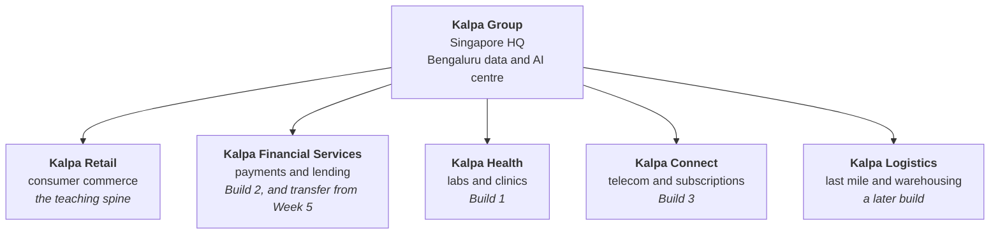
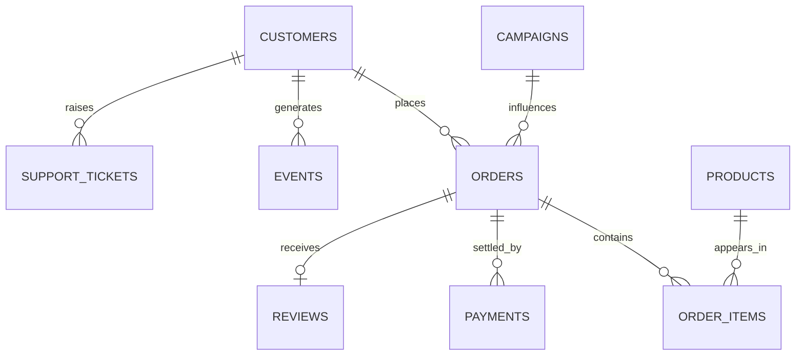
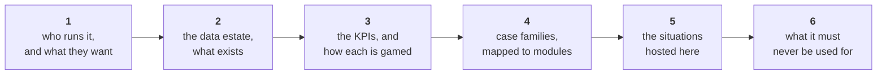

# The Kalpa world

One fictional company. Five business units. Every example in twenty weeks lives inside it, and every
module answers a harder version of the same question with a stronger tool.

Source of truth is [`docs/07_Client_Zero.md`](https://github.com/fde-academy-lab/c2-content-factory/blob/main/docs/07_Client_Zero.md),
**LOCKED at v2.2 on 13 September 2026**. These pages add personality, KPIs and case families on top of
that file. Where the two disagree, the locked file wins and this page is wrong.

> Kalpa is fictional. Any resemblance to a real company is coincidental, and that disclaimer travels
> with the name wherever it is printed.

---

## The question the whole programme answers

Kalpa Retail's revenue grew 4 percent last year against a plan of 15. Meera Raghavan, its CEO, has
asked the new data and AI team one question before she approves any marketing spend:

> **"Where does our growth actually come from, and where is it leaking?"**

That question opens Day 1 and is never fully closed. Week 1 answers it with a revenue tree computed in
plain Python. Week 2 answers it from the warehouse. Week 5 answers it with a model. Week 12 answers it
with an assistant. A learner comes to see analysis, machine learning, deep learning and generative AI
as successive answers to one business problem rather than as separate subjects.

---

## The people the room answers to

Names are fictional, they stay consistent across every artifact, and a trainer says them from memory.
**Naming a fictional stakeholder is the opposite of naming a trainer**, which never happens in a
student file.

| Name | Role | What they keep asking |
|---|---|---|
| Meera Raghavan | CEO, Kalpa Retail | Where does growth come from, and what do I do about it? One page, two minutes. |
| Anand Iyer | Finance controller, Kalpa Retail | Do your numbers match my books, and can my analyst audit how you got them? |
| The head of Retail-Plus | Owner of the paid-membership tier | Is my tier the one slipping, and who do I protect first? |
| The marketing lead | Owner of acquisition and campaigns | Prove or disprove that we need more customers; did my campaign work? |
| The data platform lead | Owner of the warehouse | Query it, do not export it; tell me before you break it. |
| Kavya Nair | Senior analyst, Kalpa Retail | The in-story mentor: show me the baseline, show me the evidence, do it a third way and choose. |
| Dr Priya Menon | COO, Kalpa Health | The Build 1 stakeholder: the same growth question in a diagnostics business. |
| Rohan Desai | Head of risk, Kalpa Financial Services | Enters Week 5: the same model where a wrong call costs twenty times more one way than the other. |
| Farhan Sheikh | Head of customer support, Kalpa Retail | Enters Week 8: two thousand tickets a day, and what the answer costs. |
| Ananya Bose | COO, Kalpa Connect | The Build 3 stakeholder: the same text problems at telecom scale, under contracts and cost ceilings. |

---

## Three threads, running the length of the programme

Two or three are open at any time. **Growth is the spine.** Trust and Cost are what a skeptic in the
room raises against every Growth answer, which is why the Situation Bank's hardest cards live there.

| Thread | The question it keeps asking | Weeks 1 to 4 | Weeks 5 to 9 | Weeks 10 to 15 |
|---|---|---|---|---|
| **Growth** | Where does growth come from, and how do we get more of it? | The revenue tree, which lever moved, baskets, cohorts, thresholds | Target who will buy again; where tabular models plateau, learn from text and images | Answer and upsell through an assistant, then an agent |
| **Trust** | Can we believe this number? | Profiling, cleaning, reconciliation with Finance, sampling and significance | Honest evaluation, leakage, the metric that matches the business cost | Grounding, citations, evaluation harnesses, monitoring |
| **Cost and risk** | What does a wrong call cost, and who bears it? | Discounts that lose money, returns, the cost of a false alarm | Asymmetric error costs in credit and fraud, imbalance | Token budgets, guardrails, refusal, human in the loop |

---

## The week ladder

Weeks 1 and 2 are fixed to the day. Weeks 3 to 9 are fixed to the day in the workbook. Weeks 10 to 20
are outline until they are detailed on go-ahead.

| Week | Unit | The business question the week answers |
|---|---|---|
| 1 | Retail | Where does revenue come from, which lever moved, can we trust the numbers, is the gap real, did the discount cause the lift, and what do we tell the CEO on Monday? |
| 2 | Retail | Finance wants the numbers from the warehouse every Monday. Are we collecting what we bill? Marketing wants one row per customer. The leadership deck lives in Excel. |
| 3 | **Health** | Build 1: five sub-problems in a diagnostics business the room has never seen |
| 4 | Retail | Which metric should the growth plan chase, which products lift order frequency, why did Retail-Plus frequency fall, and whom do we discount when a wrong pick costs money? |
| 5 | Retail, then **Financial Services** | Can we predict who will buy again if nudged, and how good is that prediction honestly? |
| 6 | **Financial Services** | Build 2: five sub-problems where the cost of an error is asymmetric |
| 7 | Retail | The tabular model has plateaued; customers also leave reviews and photos. Can a network learn from those? |
| 8 | Retail | Support tickets and reviews arrive as text; what if the answers came automatically? |
| 9 | **Connect** | Build 3: five sub-problems on text, under output contracts and cost ceilings |
| 10 to 12 | Retail | Build the assistant that answers customers from Kalpa's own policies, with citations |
| 13 to 15 | Retail | Let the assistant act: resolve tickets, issue refunds within limits, escalate |
| 16 to 20 | Any | Propose, build, deploy and defend one Kalpa system end to end |

---

## The domain rule

| Where | Which unit | Why |
|---|---|---|
| **Weeks 1 to 4**, Module 1 | Kalpa Retail only | The review was explicit that switching domain in the first module is unfair to a room still learning the tools |
| **From Week 5**, the second worked example | Another unit, in a fixed order: Financial Services, then Health, then Connect | The concept has already landed, so the second example tests transfer |
| **Build weeks** | A different unit from the teaching before it: Health, then Financial Services, then Connect | Deliberate training for the interview question the review quoted: "you are in a health company now, tell me how you would apply this to our data" |

Real companies stay welcome in trainer notes and slides as dated, verified references. They never
replace Kalpa as the thing the room computes on.

---

## The five units at a glance

| Unit | Code | Business | The tension inside it | The trap it teaches best |
|---|---|---|---|---|
| [Kalpa Retail](Kalpa-Retail) | `RET` | Online and in-store commerce across India and South-East Asia | Stores against app, and both report to different people | Denominators and mix shift |
| [Kalpa Financial Services](Kalpa-Financial-Services) | `FIN` | Payments and consumer lending | Growth wants approvals, risk wants refusals | Imbalance and asymmetric cost |
| [Kalpa Health](Kalpa-Health) | `HLT` | Diagnostic labs and clinic operations | Clinical caution against operational throughput | Refusal, consequence asymmetry, late labels |
| [Kalpa Connect](Kalpa-Connect) | `CON` | Mobile, broadband and subscription services | Acquisition is measured monthly, retention annually | Survivorship and cohort mixing |
| [Kalpa Logistics](Kalpa-Logistics) | `LOG` | Last-mile delivery and warehousing for every unit | It is a cost centre that every unit blames | Censoring, capacity and the tail |

Logistics is the one unit the locked ladder does not schedule inside Weeks 1 to 9. It is named for a
later build, so its page is a holding page rather than a scheduled one.

---

## The entity model

Retail's tables are what the whole programme grows through: a list of dictionaries in Week 1, files on
disk, Postgres tables, a pandas frame, a feature table, then a document corpus.

Orders, customers, order items, payments, products and events carry Weeks 1 to 5. **Campaigns** enters
on Week 1 Thursday for the discount question and returns in Week 2 as the exposure table. **Reviews**
enter on Week 7 Friday and **support tickets** on Week 8 Monday, when the Growth thread turns to text.
Segments are four: Retail-Core, Retail-Plus, Business and Student. A typical order sits between
Rs 800 and Rs 3,000.

---

## The dataset ladder, and the rule about it

Every version is generated deterministically from one seed, so all sixty learners hold identical data,
and every planted feature is a witness for exactly one teaching point.

> ### Students are never told what is planted.
> The witness list is TRAINER material. It appears in the curriculum row's client-zero column, which
> is labelled TRAINER ONLY, and in the trainer notes, and nowhere a learner can read. The room is
> meant to find the bulk order by sorting and the duplicated rows by reconciling against Finance. A
> slide that announces the plant has spent the lesson.

| Version | Enters | Shape |
|---|---|---|
| `v0` | Week 1 Monday | About 30 flat order records with segment attached |
| `v1` | Week 1 Tuesday | 200 orders across two quarters, with segment and month |
| `v2` | Week 1 Wednesday | The same two quarters as `orders.csv` and `orders.json`, exported "from the ERP" |
| `v3` | Week 1 Thursday | The cleaned two quarters plus the Student segment, plus the campaigns table |
| `v4` | Week 2 | 1,000 de-duplicated orders, customers, payments, campaign exposure and a plan line, in Postgres |
| `v5` | Week 4 | Order items, products, events, a monthly series |
| `v6` | Week 5 | The customer feature table with the modelling target |
| `text` | Weeks 7 and 8 | Reviews with ratings; support tickets with resolution time and CSAT |
| `corpus` | Weeks 11 and 12 | Returns and refunds policy, delivery terms, the support playbook, product manuals, anonymised tickets |

Build weeks do not use this dataset. They use real messy data at scale, relabelled into the unit that
hosts the sub-problem.

---

## What every unit page carries

Section 3 is the one people skip and the one that matters. Every KPI in this world has a
**definition, a denominator and a way of being gamed**, and a learner who can name all three for a
metric can hold their own in an interview about a business they have never seen.

---

## What is not in Kalpa, and is an open decision

The locked file defines five units and no more. Three domains that come up often in interview
preparation have no home in Kalpa today:

| Domain | Status | What adding it would take |
|---|---|---|
| **United States healthcare**, meaning payer and claims work with its own regulatory shape | Not in the lock. Kalpa Health is diagnostic labs and clinics in India and South-East Asia. | A versioned edit to section 2, or a US claims line inside Kalpa Health |
| **Travel and airlines**, meaning fares, seats, disruption and loyalty | Not in the lock at all | A sixth unit, or a travel line under Kalpa Connect's subscription business |
| **Professional services**, meaning utilisation, staffing and billable delivery | Not in the lock at all | A sixth unit, or an internal shared-services view of the Bengaluru centre itself |

**Nobody should add these to a day pack until the Programme Head rules.** The cost of a sixth unit is
not the writing, it is that build weeks draw one sub-problem per unit, so a sixth unit changes the
shape of every build week. The cheaper move is a second line of business inside an existing unit,
which adds the domain without adding a tour stop. Tracked as
[issue #69](https://github.com/fde-academy-lab/c2-content-factory/issues/69).

---

## Naming and personality rules

1. **Kalpa's stakeholders are named**, and those names are used from memory across every artifact. A
   trainer's name never appears in a student file; a fictional CEO's always does.
2. **A stakeholder has a motive.** Meera wants a growth plan she can defend to a board. Anand wants
   his books to match. The marketing lead wants the acquisition budget approved. A card without a
   motive is a tutorial.
3. **Money is in Rs**, written as the two letters, never the currency glyph.
4. **Nothing is invented past the lock.** If a day pack needs a fact about Kalpa that the locked file
   does not carry, the build stops and names the gap. It does not guess.
