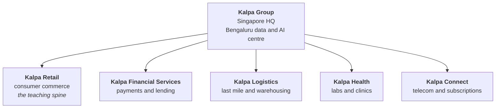
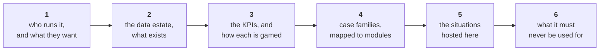

# The Kalpa world

One fictional company. Five business units. Every example in twenty weeks lives inside it, from the
first list of dictionaries in Week 1 to the capstone.

Source of truth is [`docs/07_Client_Zero.md`](https://github.com/fde-academy-lab/c2-content-factory/blob/main/docs/07_Client_Zero.md),
which is **LOCKED at v1.1** and changes only by a versioned edit signed off by the Programme Head.
These pages add personality, KPIs and case families on top of that file. Where the two disagree, the
locked file wins and this page is wrong.

> Kalpa is fictional. Any resemblance to a real company is coincidental, and that disclaimer travels
> with the name wherever it is printed.

---

## Why one company for twenty weeks

A learner who changes domain every session spends the first ten minutes of every session
re-orienting, and never accumulates the thing an interviewer is actually testing: a feel for how a
business behaves. Keeping one world means the Week 19 retrieval case sits on the same returns policy
the Week 1 `.get()` lesson was about, and the learner already knows what a return is, who is annoyed
by it and which number moves.

The cohort's team sits in the Bengaluru global capability centre, which owns the data, the models
and the AI systems that all five units run on. Each unit owns its own operations and its own
politics. That split is the whole point: the cohort is always the team that has to say something
true to a business owner who wanted a different answer.

---

## The domain rule, in three lines

| Where | Which unit | Why |
|---|---|---|
| **Teaching days** | Kalpa Retail, always | The spine never changes domain, so a new concept is the only new thing in the room |
| **Transfer moments** | Any of the other four | After a concept lands, one second example from another unit proves it was not about retail |
| **Build weeks** | One sub-problem per unit, all five | The tour, at rising depth, on real messy data relabelled into the unit |

Real companies stay welcome in trainer notes and slides as dated, verified references. They never
replace Kalpa as the thing the room computes on.

---

## The five units at a glance

| Unit | Code | Business | The tension inside it | The trap it teaches best |
|---|---|---|---|---|
| [Kalpa Retail](Kalpa-Retail) | `RET` | Online and in-store commerce across India and South-East Asia | Stores against app, and both report to different people | Denominators and mix shift |
| [Kalpa Financial Services](Kalpa-Financial-Services) | `FIN` | Payments and consumer lending | Growth wants approvals, risk wants refusals | Imbalance and asymmetric cost |
| [Kalpa Logistics](Kalpa-Logistics) | `LOG` | Last-mile delivery and warehousing for every unit | It is a cost centre that every unit blames | Censoring, capacity and the tail |
| [Kalpa Health](Kalpa-Health) | `HLT` | Diagnostic labs and clinic operations | Clinical caution against operational throughput | Refusal, consequence asymmetry, late labels |
| [Kalpa Connect](Kalpa-Connect) | `CON` | Mobile, broadband and subscription services | Acquisition is measured monthly, retention annually | Survivorship and cohort mixing |

---

## What every unit page carries

Each of the five pages has the same six sections, so a trainer looking for material knows exactly
where to look:

Section 3 is the one people skip and the one that matters. Every KPI in this world has a
**definition, a denominator and a way of being gamed**, and a learner who can name all three for a
metric can hold their own in an interview about a business they have never seen.

---

## The spine data, version by version

The teaching spine grows one file at a time, generated deterministically from one seed by
[`data/generate_client_zero.py`](https://github.com/fde-academy-lab/c2-content-factory/blob/main/data/generate_client_zero.py),
so all sixty learners hold byte-identical data and every planted defect is a witness for exactly one
teaching point.

| Version | Arrives | Shape | What it is planted to teach |
|---|---|---|---|
| `v0` | Week 1, Mon and Tue | About 30 flat order records | A type break, and an optional field that is genuinely absent |
| `v1` | Week 1, Wed and Thu | 50 records as a list, then CSV and JSON | A spelled-out amount, a missing required field, a near-duplicate, a whale, a segment too small to trust, a truncated line |
| `v2` | Week 2 | 1,000 orders in Postgres, plus payments | A join that grows 1,000 rows to 1,450 and doubles revenue, orphans on both sides, exact ties, a Simpson reversal |
| `v3` | Week 2 Fri, Week 4 | Items, products, events, a monthly series | A confidence trap at lift 0.97, blended retention flat while every cohort declines, a funnel drop that is a denominator artefact |
| `v4` | Week 4 Fri, Week 5 | A per-customer feature table with a target | Roughly 96 to 4 imbalance, a leaking field set after the outcome, a bowed residual, a sign flip from correlated features |
| `corpus` | Weeks 11 and 12 | Retail's document estate and support tickets | Two policies that contradict, a question the corpus cannot answer, a term that appears in exactly one manual |

Every one of those witnesses is a situation waiting to be written up. See
[The Situation Bank](The-Situation-Bank).

---

## What is not in Kalpa, and is an open decision

The locked file defines five units and no more. Three domains that come up often in interview
preparation have no home in Kalpa today:

| Domain | Status | What adding it would take |
|---|---|---|
| **United States healthcare**, meaning payer and claims work with its own regulatory shape | Not in the lock. Kalpa Health is diagnostic labs and clinics in India and South-East Asia. | A versioned edit to section 2, or a US claims-processing line inside Kalpa Health |
| **Travel and airlines**, meaning fares, seats, disruption and loyalty | Not in the lock at all | A sixth unit, or a travel line under Kalpa Connect's subscription business |
| **Professional services**, meaning utilisation, staffing and billable delivery | Not in the lock at all | A sixth unit, or an internal shared-services view of the Bengaluru centre itself |

**Nobody should add these to a day pack until the Programme Head rules.** The cost of a sixth unit is
not the writing, it is that build weeks draw one sub-problem per unit, so a sixth unit changes the
shape of every build week. The cheaper move is a second line of business inside an existing unit,
which adds the domain without adding a tour stop.

---

## Naming and personality rules

1. **Role labels, never personal names.** "Head of Retail Stores", "VP Subscriptions", "Operations
   lead for diagnostic labs". A name can be substituted locally if a record needs one, and it never
   ships in a student file.
2. **A stakeholder has a motive.** The Head of Stores whose expansion plan is up for approval asks a
   different question from a CFO who has already decided to close stores. A card without a motive is
   a tutorial.
3. **Money is in Rs**, written as the two letters, never the currency glyph. A typical Retail order
   sits between Rs 800 and Rs 3,000, and the planted whale at Rs 480,000 exists precisely because it
   breaks that band.
4. **Nothing is invented past the lock.** If a day pack needs a fact about Kalpa that section 1 to 8
   of the locked file does not carry, the build stops and names the gap. It does not guess.
