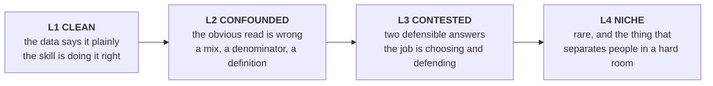
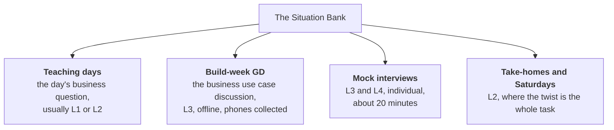
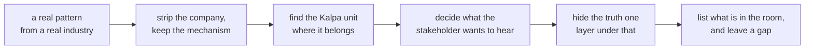

# The Situation Bank

A library of **business situations**, graded by how hard they are to see through, sorted by which
Kalpa unit they live in and which module they exercise.

The bank exists because of one observation about interviews at the level this cohort is aiming at:
almost nobody fails on the algorithm. They fail on the fifteen minutes before it, where a vague
business complaint has to become a defensible technical question.

> **A situation is a complaint, a symptom and a stakeholder. It is not a task.**
> The moment a card says "build a churn model", it has done the candidate's job for them.

---

## The one rule

**Situations, never solutions.** Every card carries what the business says, what is actually true
underneath, and why the obvious read is wrong. It never carries the answer, the method or the model.

That is not a stylistic preference. The whole skill being trained is the decomposition, and a card
that decomposes the problem has spent the thing it was meant to teach.

---

## The difficulty ladder

Four levels. The level is not about how much maths it takes. It is about **how far the truth sits
from the first thing you would look at.**



| Level | The tell | A candidate who stops here | Typical use |
|---|---|---|---|
| **L1 Clean** | One number, one denominator, no trap | Passes a screening round | Week 1 to 4 teaching, warm-ups |
| **L2 Confounded** | The headline moves for a reason nobody named | Fails a good interview, confidently | The bread and butter of the bank |
| **L3 Contested** | Two people can both be right; the cost of being wrong differs | Fails when asked "and what would you tell the CFO?" | Build-week GDs, mocks |
| **L4 Niche** | Almost nobody has met it; recognising it is the signal | This is what separates the top of a shortlist | Expert days, hard mocks, ME rounds |

**Build for L2 and L3.** L1 fills a teaching slot, L4 is a garnish. The programme's centre of
gravity is the situation where the obvious answer is wrong and the right one has to be argued.

---

## The card format

Every situation is one card. The learner sees only the top half. The bottom half is `INTERNAL` and
exists so a trainer knows what the room is walking into.

```
### S-RET-AN-03 · The footfall that fell but did not

| | |
|---|---|
| **Unit** | Kalpa Retail |
| **Module** | 1, Foundations of AI and Data |
| **Level** | L2 Confounded |
| **Asked by** | Head of Retail Stores, in the Monday review |

**What they say**
"Footfall is down eleven percent this quarter. Find out why, and tell me by Friday."

**What is in the room**  ← the assets, not the answer
Store entry counts by day and store, the store master with open and close dates, the
promotions calendar, the app's delivery orders by pincode.

--- INTERNAL BELOW THIS LINE ---

**What is actually true**
…the twist…

**Why the obvious read fails**
…

**The first question a strong candidate asks**
…

**The KPI that settles it**
…

**Where it turns technical**
…

**How it escalates** (to L3, to L4)
…
```

Four things make a card good:

1. **The stakeholder is a person with a motive**, not "the business". A Head of Stores whose bonus
   rides on footfall asks a different question from a CFO who has already decided to close stores.
2. **What is in the room is listed, and it is incomplete.** Real problems arrive with the wrong
   data. Asking for what is missing is half the skill.
3. **The twist is a business fact, not a data-quality bug.** "The join was wrong" is a lab
   exercise. "Two stores closed in March and the denominator never changed" is a business
   situation.
4. **It escalates.** The same card at L2 for Week 2 and at L3 for a build week, by changing what is
   known rather than by adding maths.

---

## The identifier

```
S - RET - AN - 03
    │     │     └── serial within that unit and module
    │     └──────── module family
    └────────────── Kalpa unit
```

| Unit | Code | Module family | Code |
|---|---|---|---|
| Kalpa Retail | `RET` | Analytics and data foundations (module 1) | `AN` |
| Kalpa Financial Services | `FIN` | Machine learning (modules 2, 3) | `ML` |
| Kalpa Logistics | `LOG` | NLP, GenAI, production and agentic (modules 4 to 9) | `GA` |
| Kalpa Health | `HLT` | | |
| Kalpa Connect | `CON` | | |

A card keeps its identifier for life. When it is rewritten, the identifier stays and the change goes
in [What's changed](Whats-changed), so a trainer who taught `S-RET-AN-03` last cohort knows what
moved.

---

## Where situations are used



The build-week **business use case discussion** already exists in the locked programme facts: a
group discussion on the build-week Monday, offline with phones collected, roughly 30 to 45 minutes
of preparation then an hour of discussion, output written on a board, no presentation. It runs at
progressive complexity and is deliberately **not** tied to the module's technical content.

That is the bank's most important customer. See [Running a Situation Room](Running-a-Situation-Room).

---

## How a situation is built



**Step 4 is where cards are won or lost.** A stakeholder who wants the truth is a tutorial. A
stakeholder who wants a particular answer is an interview.

Two failure modes to avoid:

| Failure | Looks like | Why it is dead |
|---|---|---|
| The riddle | A single clever trick, one right answer | Trains pattern-matching, not judgment. A room that has seen it once is done. |
| The essay | So open that any answer is fine | Nothing to be wrong about, so nothing to defend, so nothing is learned |

A good card has a **wrong obvious answer** and a **defensible right one**, and the gap between them
is a business fact somebody should have asked about.

---

## The pages

| Page | Modules | What lives there |
|---|---|---|
| [Situations: analytics](Situations-analytics) | 1 | Denominators, mix shift, confounding, seasonality, the metric that lies |
| [Situations: machine learning](Situations-machine-learning) | 2, 3 | Label definition, leakage, imbalance, cost asymmetry, drift |
| [Situations: GenAI and agents](Situations-GenAI-and-agents) | 4 to 9 | Retrieval, refusal, evaluation, cost per task, autonomy limits |

---

## Contributing a situation

1. Draft it against the card format above, in the right page, with a new identifier.
2. Mark it **`seed`** if it came from a real reported pattern, **`built`** if it was constructed for
   teaching. Both are fine. Pretending is not.
3. Open a pull request against `wiki/`. It gets reviewed like any content change.
4. A card is not finished until somebody who did not write it has tried to answer it and been wrong
   in the intended way. That is the only test that matters.
