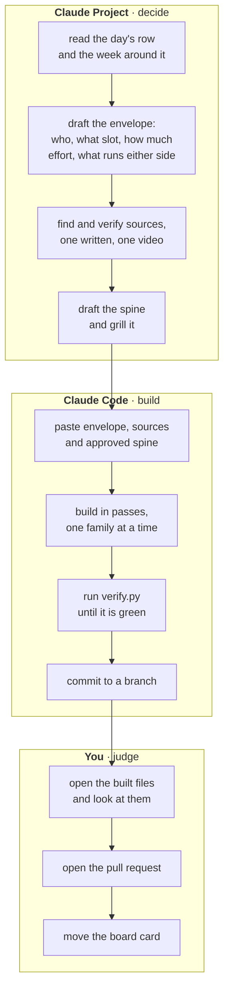
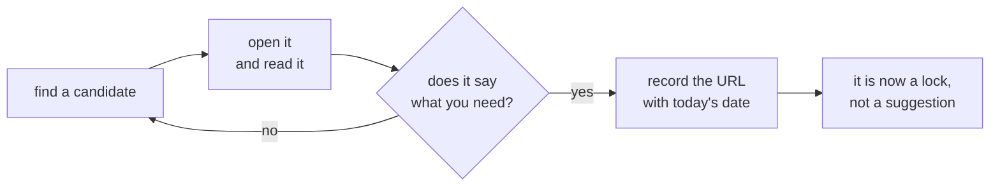

# The blended workflow

**Think in a Project, build in Code.** This is what most real work turns out to be, and naming it as
a workflow stops people from doing half of it by accident.

The principle behind it is one line: **decisions are cheap to change while they are still prose, and
expensive once they are twelve files.**

---

## The shape



The line between the two boxes is the spine gate. Everything to the left is reversible in a
sentence. Everything to the right costs a build.

---

## Why the split is worth the handoff cost

| Stage | Wrong tool | What it costs |
|---|---|---|
| Deciding the envelope | Claude Code | A session with no envelope builds something plausible and the wrong size, and you find out at the end |
| Verifying sources | Claude Code, mid-build | Links get invented under time pressure. Lock them before the build starts. |
| Grilling the spine | Claude Code | The session that wrote the spine is the worst critic of it |
| Building the artifacts | A Project | Nothing executes, so nothing is proved |
| Judging the result | Either model | A human opens the PDF. That step has no substitute. |

---

## The handoff message

This is the whole workflow in one paste. Everything the build session needs, and nothing it has to
guess:

```
Build the day pack for W03/D2.

ENVELOPE
  Audience: the cohort, in week three, after two weeks of Python and SQL.
  Slot: a teaching day of two blocks.
  Effort it can absorb: <what the learner can carry>
  Before: D1 left them with <x>. After: D3 needs <y>.

SOURCES, locked. Use these rather than searching.
  <link>   written reference, checked 10 Sep 2026
  <link>   video, checked 10 Sep 2026
  <link>   the tool's own documentation, checked 10 Sep 2026

SPINE, approved.
  Mental model: <the one picture>
  Block 1: <at most four new ideas>
  Deliberate failure: <the exact error text they will see>
  Block 2: <...>
  Close: <the sentence the learner would send a stakeholder>

Build in passes. Stop after each family and tell me what you built.
Run python3 scripts/verify.py content/W03/D2 before you commit.
Commit to branch w03-d2. Do not open the pull request.
```

**The last two lines matter more than they look.** "Stop after each family" makes the session
reportable rather than a wall of output, and "do not open the pull request" keeps a human between
the build and the branch everybody else works from.

---

## Where sources get locked, and why it is this early

The hard rule is that every URL in an artifact was verified the day it entered and carries that
date, and an unverified slot says "to be found" rather than carrying a guess.

Doing that during a build is the failure mode. A session that is three passes deep and needs a
reference for slide eleven will produce something that looks exactly like a reference. Locking the
sources in the Project, before any file exists, removes the pressure that causes it.



Links the requester supplies are a lock rather than a starting point. A build session does not go
looking for something better.

---

## The variant for a fix rather than a build

Blending is overkill for a one-artifact repair. The short version:

| Step | Where |
|---|---|
| Decide whether it is a raise or a rebuild | A Project, in two minutes, or in your head |
| Make the change and look at the result | [Desktop](Claude-Code-on-desktop) |
| Run the gate on the folder, not the file | Desktop |
| Commit on the day's branch | Desktop |

**Raise or rebuild is the judgment worth naming.** A raise keeps the artifact's structure and
improves it. A rebuild throws the structure away. When you cannot tell which one a change is, list
it and ask, because a rebuild that was described as a raise is how a reviewer loses a day.

---

## The failure mode of this workflow

The Project becomes a place where good thinking goes to be forgotten. A decision reached in a chat
is invisible to the next person, and it gets re-made differently in three weeks.

The fix is mechanical: any decision that will outlive the day goes into
[What's changed](Whats-changed) as a dated line, in the same pull request as the content it
affected.
